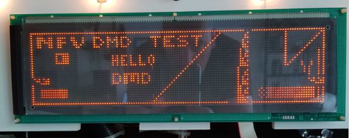

# Pinball_LEDDMD

## Goal
The main goal is to create a usable converter for pinball dmd signals.

There are a few methods to get the data:
- use the 128x64 dmd pins as input
- use the WPC J601/J602 IO connectors to snoop the dmd data
- snoop the 6800 bus directly on the cpu.

## dmd to hub75

Hardware: Altera Cyclone IV EP4CE6E22C8 FPGA

Using a level shifter to convert the 5 volt DMD signals to HUB75 RGB output. Keeping the color as original as possible.

## Utilities
Test utilities for arduino are present in this repository.
- dmdtest_arduino
- ledtest_arduino

### dmdtest_arduino
Hardware: arduino mega2560

Test on original DMD:

Test on RGB display:

It's hard to photograph the color of the displays.

This utility generates a signal to test dmd's.

The high page is shown twice and the low page once to get 66%/33% dimmscales.

The per page refresh rate is around 195Hz.

Full frame rate is around 65Hz. (high/high/low)

### ledtest_arduino

Hardware: arduino mega2560

This utility genrates a color pattern to test the HUB75 display.